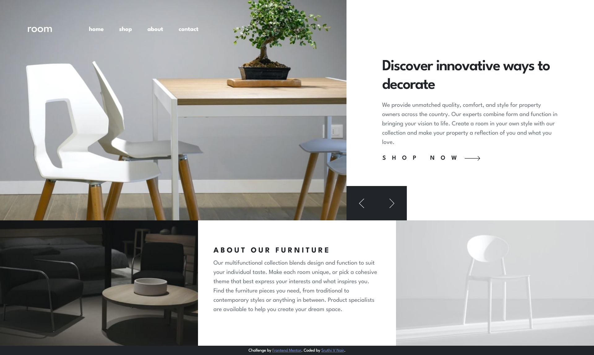
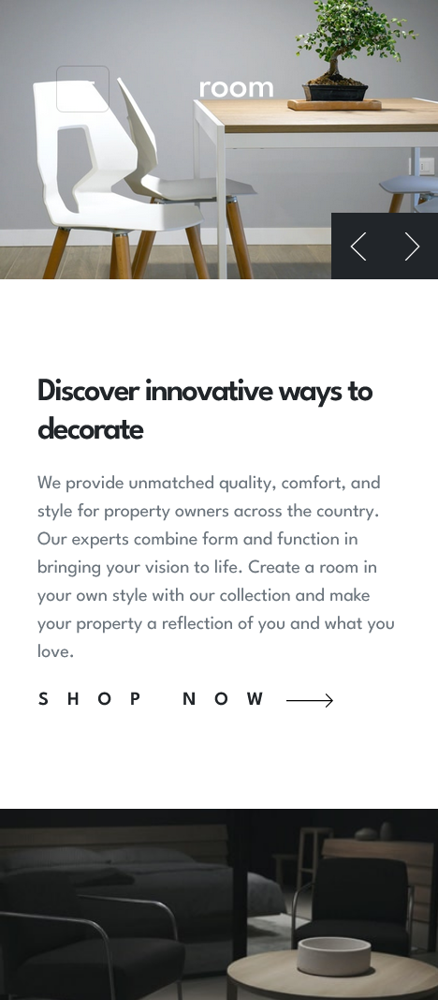

# Frontend Mentor - Room homepage solution

[This](https://sruthi-nair166.github.io/room-homepage/) is a solution to the [Room homepage challenge on Frontend Mentor](https://www.frontendmentor.io/challenges/room-homepage-BtdBY_ENq).

## Table of contents

- [Overview](#overview)
  - [The challenge](#the-challenge)
  - [Screenshot](#screenshot)
  - [Links](#links)
- [My process](#my-process)
  - [Built with](#built-with)
  - [What I learned](#what-i-learned)
  - [Continued development](#continued-development)
  - [Useful resources](#useful-resources)
- [Author](#author)
- [Acknowledgments](#acknowledgments)

## Overview

### The challenge

Users should be able to:

- View the optimal layout for the site depending on their device's screen size
- See hover states for all interactive elements on the page
- Navigate the slider using either their mouse/trackpad or keyboard

### Screenshot

#### Desktop View

#### Mobile View

### Links

- Solution URL: [https://github.com/sruthi-nair166/room-homepage](https://github.com/sruthi-nair166/room-homepage)
- Live Site URL: [https://sruthi-nair166.github.io/room-homepage/](https://sruthi-nair166.github.io/room-homepage/)

## My process

### Built with

- Semantic HTML5 markup
- Bootstrap 5 (grid system & components)
- Vanilla JavaScript

### What I learned

Things I learned from this project are:

- Building a responsive hero section with an interactive image slider that supports previous/next navigation.

- Syncing dynamic text content with image slides while preserving layout integrity.

- Handling keyboard accessibility: ensuring buttons and interactive elements are focusable and visible across desktop and mobile.

- Using Bootstrap’s grid and utility classes while overriding default styles for custom layout and button behavior.

- Implementing smooth slide transitions and visually appealing focus states for interactive elements.

- Using modern CSS techniques like clamp() to create fluid, responsive spacing and typography without relying solely on media queries.

### Continued development

Features I wish to add/learn about in the future:

- Advanced accessibility techniques, like managing focus states across complex interactive components and ensuring keyboard & screen reader usability in all layouts.

- Creating smooth, dynamic animations that feel natural and polished.

### Useful resources

- [Bootstrap Docs](https://getbootstrap.com/docs/) - Referenced to implement the responsive grid layout, utility classes, navbar and carousel components.

## Author

- Github - [@sruthi-nair166](https://github.com/sruthi-nair166)
- Frontend Mentor - [@sruthi-nair166](https://www.frontendmentor.io/profile/sruthi-nair166)
- Linkedin - [Sruthi V Nair](https://www.linkedin.com/in/sruthi-v-nair/)

## Acknowledgments

I would like to thank Frontend Mentor and it's availability of various projects for giving me this opportunity to be able to do this project which simulates real-world specifications.
